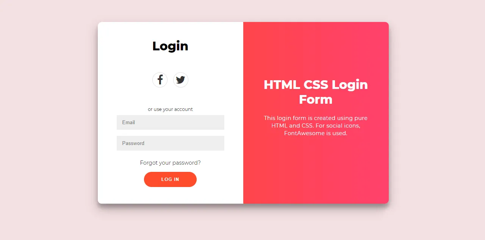

# react-login-page
Created a react + tailwindcss login page for training purposes.

## Source

## My Version

### Study Sources

- [Add Custom Fonts](https://dev.to/sabinthedev/adding-custom-font-classes-to-tailwindcss-o5l)
- [Basic Login Form with React.js, Tailwind CSS & TypeScript (just the frontend part)](https://www.youtube.com/watch?v=Jgdx_qykoPw)